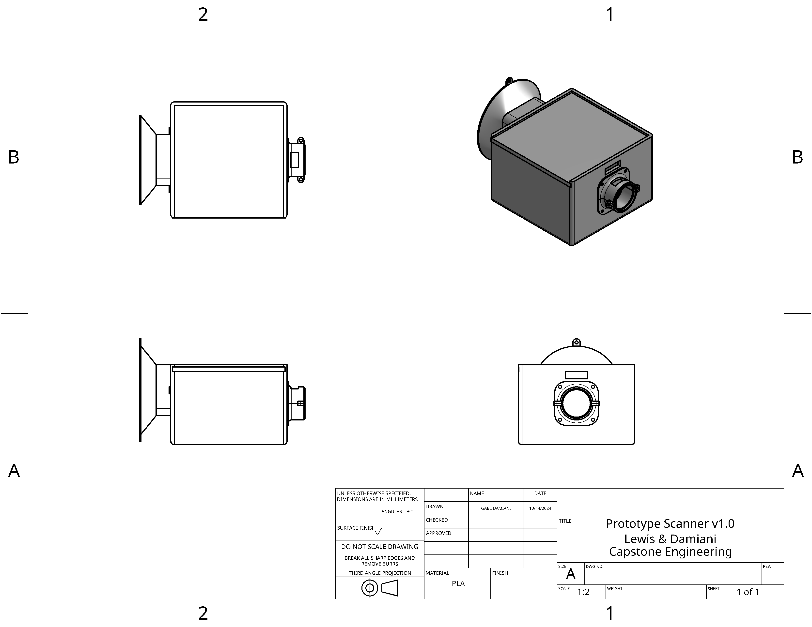

# 2024-10-09
## Probing Bluetooth sound sink with oscilloscope
When no audio playing: All 3 lines 0 V
When audio playing: PHY12/DIN 200-210kHz square wave phase varying, PHY14/BCLK 1.411 MHz square wave, PHY15/LRC 44.1kHz square wave (implies 44.1kHz audio, 16 bits per channel, 2 channels)
No tone heard
Config: PICO_AUDIO_I2S_DATA_PIN=9, PICO_AUDIO_I2S_CLOCK_PIN_BASE=10
## Probing I2S tone test
When no audio playing: All 3 lines 0V
When audio playing: PHY12/DIN 27-23kHz square wave phase varying, PHY14/BCLK 209kHzish square wave, PHY15/LRC 6KHzish (implies 6kHzish audio, 16 bits per channel, 2 channels, actual sample rate 8kHz)
Audio distorted or mangled when PHY15 touched by probe
No audio when PHY14 touched by probe
Config: audiobusio.I2SOut(board.GP10, board.GP11, board.GP9)
## Trying Bluetooth again w/o probes
Still no audio at any volume

## Idea: lower sample rate in Bluetooth version, that's the most significant difference I see. The werid behavoir when I touch it with a probe makes me think it might be an impedance thing, and 44.1kHz is unfavorable for my setup.
can't find the place where sample rate is set though...

# 2024-10-10

## Switching architecture
Due to repeated issues with establishing a bluetooth connection capable of streaming audio to a pico, we are switching to only using the pico and scanner to send the UPC info over bluetooth, having the iphone connect to the server over cell connection and getting back the MP3 file to stream over its own speakers or the speakers of any physically connected devices (double bluetooth connection is a bridge we will cross when we get there). This requires more work on the app side of things, but will make the bluetooth streaming far easier because we don't have to stream audio files over bluetooth, only UPC data. Much easier!

## Switch framework for app
We're switching to using .Net Maui as opposed to Flutter because we have a little more experience with it and are more familiar with C# than Dart. This shouldn't be hard because we haven't done much of anything with Flutter yet, so it makes very little difference.

# 2024-10-14

## Finished redesign & fabrication
Completed prototype v1.0 with all circuitry and casing completed. Everything fits together well enough, testing needs to be completed next. Prototype v1.0 is runnin stage 1 architecture, meaning it is wifi enabled and does the processing on the server we've set up. See drawing here. 

## Switching framework, again
Turns out MAUI is very particular about what version of XCode it runs with, and our machine can't run that version, so we're switching back to Flutter. 

# 2024-10-22
## Flutter app progress
Got a Flutter app sketched out, but I can't use Audioplayers because it needs XCode 15. I'll try to downgrade or use a different audio framework.